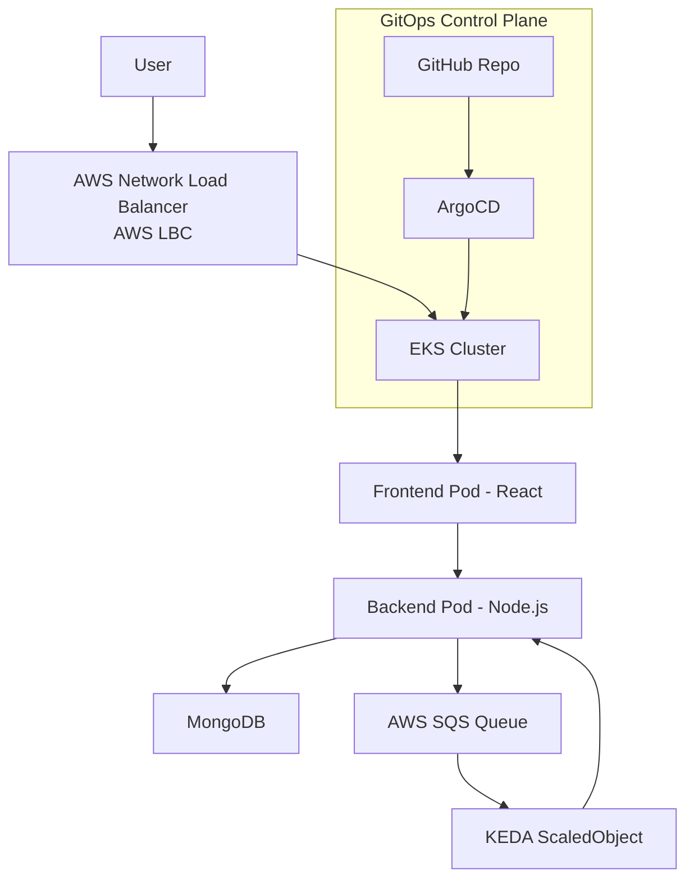
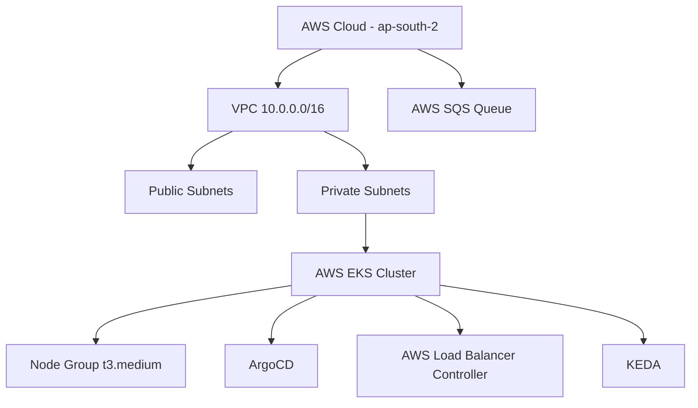

# 🛒 Ecommerce Store — GitOps Infrastructure on AWS EKS

A **production-grade**, fully automated 3-tier e-commerce platform deployed on AWS EKS using modern DevOps practices and GitOps principles.

Every piece of infrastructure is defined as code with **Terraform**, and all Kubernetes manifests are version-controlled and continuously synced using **ArgoCD**.

---

## 📋 Table of Contents
- [Architecture Overview](#architecture-overview)
- [Tech Stack](#tech-stack)
- [Repository Structure](#repository-structure)
- [Key Features](#key-features)
- [Infrastructure Components](#infrastructure-components)
- [GitOps & Deployment Flow](#gitops--deployment-flow)
- [Auto-Scaling with KEDA](#auto-scaling-with-keda)
- [Prerequisites](#prerequisites)
- [Deployment Guide](#deployment-guide)
- [Troubleshooting](#troubleshooting)
- [Author](#author)

---

## Architecture Overview

### High-Level Request Flow



### Infrastructure Layout



---

## Tech Stack

| Layer                  | Technology                          |
|------------------------|-------------------------------------|
| Cloud                  | AWS (ap-south-2)                    |
| Orchestration          | Amazon EKS (Kubernetes 1.32)        |
| IaC                    | Terraform                           |
| GitOps                 | ArgoCD                              |
| Autoscaling            | KEDA + AWS SQS                      |
| Load Balancing         | AWS Load Balancer Controller (NLB)  |
| Frontend               | React                               |
| Backend                | Node.js                             |
| Database               | MongoDB 6.0                         |
| Container Registry     | Docker Hub                          |

---

## Repository Structure

```bash
ecommerce-infra-gitops/
├── k8s-manifest/                  # All Kubernetes resources (managed by ArgoCD)
│   ├── argo-app.yml               # ArgoCD Application CR
│   ├── namespace.yml
│   ├── deployment.yml
│   ├── services.yml
|   ├── quick-tunnel.yml
|   ├── serviceaccount.yml
│   ├── keda-auth.yml
│   └── keda-scaledobject.yml
│
└── terraform/
    ├── infra/                     # Layer 1: Core AWS resources
    │   ├── terraform.tf
    |   ├── ec2.tf
    │   ├── vpc.tf
    │   ├── eks.tf
    │   ├── output.tf
    |   ├── provider.tf
    │   └── variables.tf
    │
    ├──remote-infra/              # Layer 3: Remote infra for terraform.tfstate
    |   ├── provider.tf
    |   ├── s3.tf
    |   ├── terraform.tf
    |   ├── varaibles.tf
    |
    └── addons/                    # Layer 2: Kubernetes addons
        ├── terraform.tf
        ├── providers.tf
        ├── argocd.tf
        ├── sqs-irsa.tf
        ├── sqs.tf
        ├── monitoring.tf
        ├── aws-lbc.tf
        ├── keda.tf
        └── variables.tf
```

---

## Key Features

- **Fully GitOps** – Zero manual `kubectl apply`
- **Infrastructure as Code** – Complete AWS environment provisioned with Terraform
- **Secure by Default** – Private subnets, IRSA (IAM Roles for Service Accounts), least privilege
- **Event-Driven Autoscaling** – KEDA scales backend pods based on SQS queue depth (0 to 10 pods)
- **Cost Optimized** – Scales to zero when idle + single NAT Gateway
- **Reproducible** – Git commit SHA tagged images + declarative manifests

---

## Infrastructure Components

**Layer 1 (Core Infra)**
- VPC with public & private subnets across 2 AZs
- Secure EKS cluster with managed node groups (t3.medium, 1–5 nodes)
- AWS SQS queue for asynchronous order processing

**Layer 2 (Addons)**
- ArgoCD for GitOps
- AWS Load Balancer Controller (NLB)
- KEDA for event-driven scaling

---

## GitOps & Deployment Flow

1. Developer pushes changes to GitHub
2. ArgoCD detects changes in the `k8s-manifest/` directory
3. ArgoCD automatically syncs and applies updates to EKS
4. Backend pods scale dynamically via KEDA based on SQS queue depth

---

## Auto-Scaling with KEDA

KEDA monitors the `ecommerce-orders-queue` and scales the backend deployment intelligently:

- **0 messages** → 0 pods (scale-to-zero, saves cost)
- **10 messages** → 1 pod
- **50+ messages** → Up to 10 pods (configurable max)

**Polling interval**: 15s | **Cooldown**: 5 minutes

---

## Prerequisites

- AWS CLI (configured)
- Terraform ≥ 1.5
- kubectl & Helm
- Docker Hub account

---

## Deployment Guide

### 1. Clone the repository
```bash
git clone https://github.com/SamarthLambture/ecommerce-infra-gitops.git
cd ecommerce-infra-gitops
```

### 2. Deploy Core Infrastructure
```bash
cd terraform/infra
terraform init
terraform apply -auto-approve
```

### 3. Update kubeconfig
```bash
aws eks update-kubeconfig --region ap-south-2 --name ecommerce-app-eks
```

### 4. Deploy Addons
```bash
cd ../addons
terraform init
terraform apply -auto-approve
```

### 5. Register Application with ArgoCD
```bash
kubectl apply -f k8s-manifest/argo-app.yml
```

The application will be live shortly. Access it via the NLB URL.

---

## Troubleshooting

- Pods in Pending? → Check node capacity: `kubectl describe nodes`
- NLB not reachable? → Verify security group rules
- ArgoCD sync issues? → `kubectl describe application -n argocd`
- KEDA not scaling? → `kubectl describe scaledobject -n ecommerce-app-ns`

---

## Author

**Samarth Lambture**  
3rd Year B.Tech Student | DevOps & Cloud-Native Enthusiast  

- GitHub: [@SamarthLambture](https://github.com/SamarthLambture)
- LinkedIn: [Connect with me](https://linkedin.com/in/yourprofile)

---

**Built with ❤️ using Terraform, AWS EKS, ArgoCD, and KEDA**
